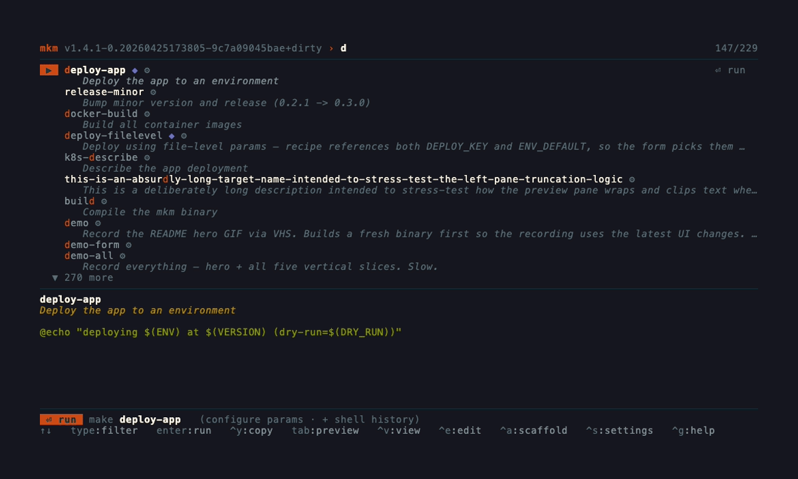
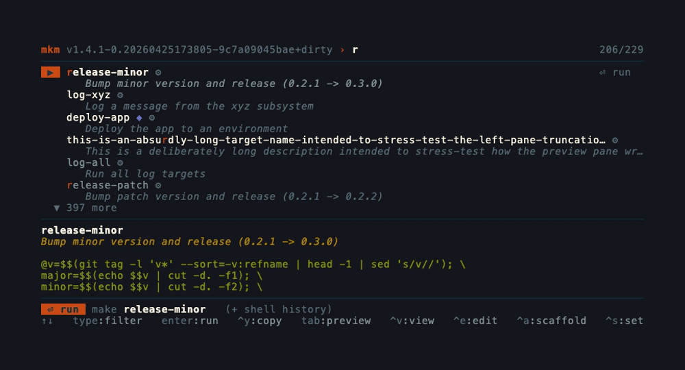
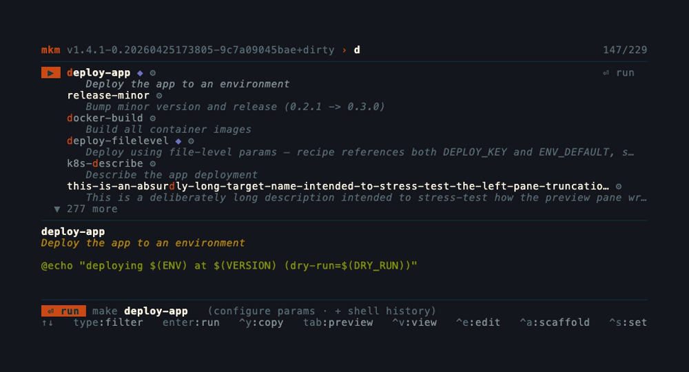
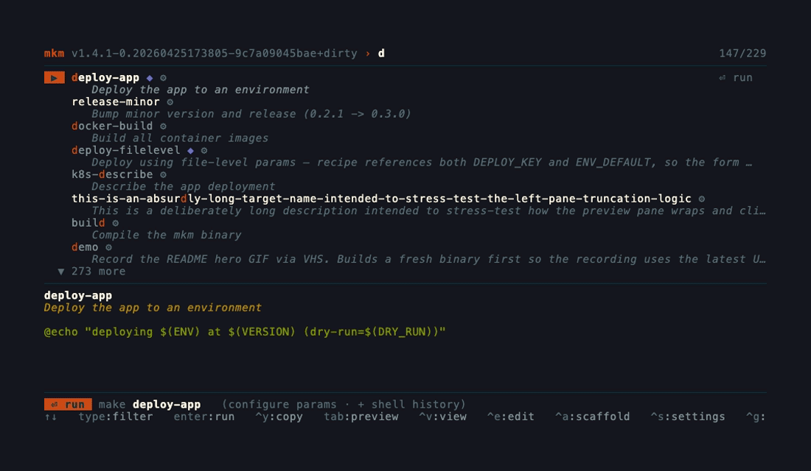
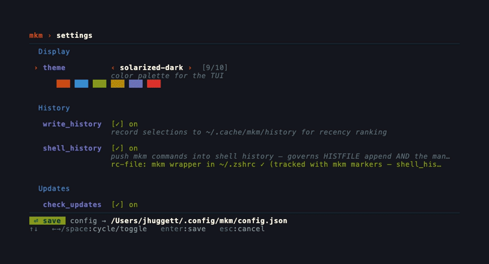

<h1 align="center">mkm</h1>

<p align="center">
  <strong>A keyboard-first TUI for discovering and running Makefile targets.</strong>
  <br />
  Fuzzy filter. Typed input forms. In-TUI viewer. Live theme preview.
</p>

<p align="center">
  <a href="https://github.com/jhuggett/mkm/releases"></a>
  <a href="https://pkg.go.dev/github.com/jhuggett/mkm"></a>
  
  
</p>

<p align="center">
  
</p>

<p align="center">
  <sub>Recordings are generated from <a href="docs/">VHS tapes</a> in this repo — <code>make demo-all</code> to refresh them.</sub>
</p>

---

## Why mkm

Makefiles are the de-facto task runner for a lot of projects, but the user experience tops out at `cat Makefile | grep`. mkm makes them ergonomic:

- **Discoverable.** Recursively finds every Makefile in a project and groups targets by directory. Self-documenting `## description` and `# @param` comments turn into a real UI.
- **Fast to filter.** Fuzzy match across name *and* description. Recently-run targets float to the top.
- **Safe to run.** Required parameters are enforced. The make command is rendered live as you fill the form, color-coded so you can see exactly what will execute.
- **No yak shaving.** Up-arrow in your shell still recalls every command mkm launched. One keystroke installs the wrapper.

## Install

```sh
go install github.com/jhuggett/mkm@latest
```

Run `mkm` in any directory containing a Makefile. To make up-arrow in your shell recall mkm-launched commands, press `^s`, focus the `shell_history` row, hit `^a`, then `source ~/.zshrc` (or open a new shell).

## Quick start

```sh
$ cd ~/my-project
$ mkm
```

Type to filter. `enter` runs the highlighted target. `^g` shows the full keymap.

For muscle memory:

```sh
$ mkm --last        # skip the picker, rerun the most recent target
```

## Features

#### Fuzzy filter that finds what you mean

Matches on target name with a fall-through to the description, so a target named `bpdi` whose comment says *"build prod docker image"* shows up when you type `docker`. Recently-run targets are boosted; never-run targets keep the default weight so they don't disappear.

<p align="center">
  
</p>

#### Typed parameter forms

Annotate variables with `@param` comments and mkm turns them into a real form:

```make
# Deploy the app
# @param {dev|staging|prod} ENV            target environment
# @param {string} [VERSION=latest]         release tag
# @param {bool} [DRY_RUN=false]            preview without executing
deploy:
	./deploy.sh
```

Selecting `deploy` opens a form for `ENV`, `VERSION`, and `DRY_RUN`. Required fields are enforced. Enums let you tab through options or type-ahead by letter. The composed `make deploy ENV=prod VERSION=v1.2.3 DRY_RUN=false` is shown live above the keymap. Full spec in [PARAMS.md](PARAMS.md).

<p align="center">
  
</p>

#### Scaffold annotations from existing recipes

Pressing `^a` on a target scans its recipe for `$(VAR)` references, drops them into a form, and writes a well-formed `@param` block back into your Makefile. A GitHub-style diff preview shows exactly what will change before you commit.

<p align="center">
  
</p>

#### In-TUI Makefile viewer

`^v` opens the source for the current target inline, with light syntax styling. `n` / `N` jump between target definitions. `e` opens `$EDITOR` at the current line.

<p align="center">
  
</p>

#### Ten themes, live preview

`^s` opens settings. Cycling the theme repaints the whole UI as you scroll, so you can compare before saving. A color swatch under the picker shows the palette at a glance.

<p align="center">
  
</p>

<details>
<summary>Theme list</summary>

`nord`, `dracula`, `solarized-dark`, `mono`, `gruvbox-dark`, `tokyo-night`, `catppuccin-mocha`, `rose-pine`, `one-dark`, `github-dark`.

</details>

#### Shell-history integration

By default mkm appends launched commands to `$HISTFILE` (zsh/bash). The settings page can install a managed wrapper for you, with a line-numbered preview of the rc-file change before it lands. Toggling the setting later keeps the wrapper in sync.

## Indicators

A target row may carry up to three glyphs:

| Glyph | Meaning |
|-------|---------|
| `◆` | Target has applicable `@param` documentation (its own or file-level). Selecting opens the input form. |
| `◇` | Recipe references `$(VAR)` that aren't documented or file-assigned. Press `^a` to scaffold annotations. |
| `⚙` | Target is `.PHONY` — an action recipe, not a file-producing rule. |

## Keybindings

<details>
<summary><strong>List mode</strong></summary>

| Key | Action |
|-----|--------|
| `↑` `↓` / `^p` `^n` / wheel | Move cursor |
| any letter | Fuzzy filter |
| `^w` | Delete previous word in filter |
| `backspace` | Delete previous char |
| `esc` | Clear filter, then quit |
| `enter` | Run target (or open param form) |
| `tab` | Toggle preview pane |
| `^v` | View Makefile in-TUI |
| `^e` | Open `$EDITOR` at target line |
| `^y` | Copy the make command without running |
| `^a` | Scaffold `@param` block from recipe vars |
| `^s` | Open settings |
| `^u` | Copy `go install …@latest` (when an update is available) |
| `^x` | Dismiss the update banner for this session |
| `^g` | Show full help |
| `^c` | Quit |

</details>

<details>
<summary><strong>Viewer</strong></summary>

| Key | Action |
|-----|--------|
| `j` `k` / `↑` `↓` / wheel | Line down / up |
| `n` `N` | Next / previous target definition |
| `g` `G` | Top / bottom of file |
| `^d` `^u` | Half-page down / up |
| `e` (or `^e`) | Open `$EDITOR` at current line |
| `esc` / `q` | Back to list |

</details>

<details>
<summary><strong>Param form</strong></summary>

| Key | Action |
|-----|--------|
| `↑` `↓` / `tab` / wheel | Move between fields |
| `←` `→` / `space` | Cycle enum, toggle bool |
| typing | Edit text field |
| `a`-`z` | Type-ahead jump in enum fields |
| `^u` | Clear current text field |
| `enter` | Run (blocked if required fields are empty) |
| `esc` | Back to list |

</details>

<details>
<summary><strong>Scaffold form</strong></summary>

| Key | Action |
|-----|--------|
| `↑` `↓` / `tab` / wheel | Move between fields (any param) |
| `←` `→` / `space` | Cycle type, toggle required |
| typing / `^u` | Edit name / default / options / desc |
| `^n` | Add a new param row |
| `^d` | Delete the focused param row |
| `enter` | Write formatted `@param` lines to the Makefile |
| `^e` | Write, then open `$EDITOR` for tweaks |
| `esc` | Cancel |

</details>

<details>
<summary><strong>Settings</strong></summary>

| Key | Action |
|-----|--------|
| `↑` `↓` / `tab` / wheel | Move between fields |
| `←` `→` / `space` | Cycle / toggle |
| `a`-`z` (theme row) | Type-ahead jump |
| `^a` (shell_history row) | Apply the rc-file wrapper fix |
| `^y` (shell_history row) | Copy wrapper snippet to clipboard |
| `^r` (shell_history row) | Copy `source <rc-file>` reload command |
| `^e` (shell_history row) | Edit rc file in `$EDITOR` |
| `^v` (shell_history row) | View rc file in-TUI |
| `enter` | Save config |
| `esc` | Cancel, revert theme preview |

</details>

## CLI flags

| Flag | Behavior |
|------|----------|
| `--last` | Skip the TUI and rerun the most recently recorded target |
| `--print`, `-p` | Print the selected command instead of executing it (for shell wrappers) |
| `--run`, `-r` | No-op alias kept for backward compatibility |

## Configuration

Config lives at `~/.config/mkm/config.json`, created with defaults on first run:

```json
{
  "theme": "nord",
  "write_history": true,
  "shell_history": true,
  "check_updates": true
}
```

| Field | Default | Notes |
|-------|---------|-------|
| `theme` | `nord` | One of the ten built-in themes. Unknown values fall back to `nord`. |
| `write_history` | `true` | Records selections to `~/.cache/mkm/history` for recency ranking. Disable if history writes aren't working in your environment. |
| `shell_history` | `true` | Append executed commands to `$HISTFILE` (zsh / bash). Combined with the managed wrapper, makes up-arrow recall mkm-launched commands. |
| `check_updates` | `true` | Daily GitHub poll for new releases. Result cached in `~/.cache/mkm`. |

Edit live with `^s`. The theme repaints as you cycle; `enter` persists, `esc` reverts.

## Releasing

`make release-patch` / `release-minor` / `release-major` reads the latest `v*` git tag, computes the next semver, tags `HEAD`, and pushes the tag. The update banner inside mkm picks it up within a day for everyone running an older release.
